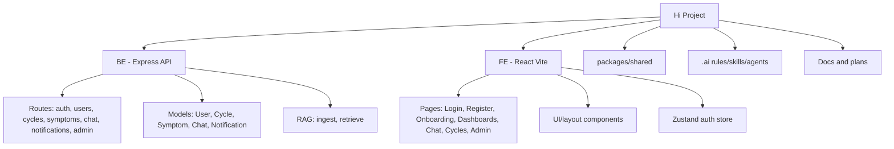
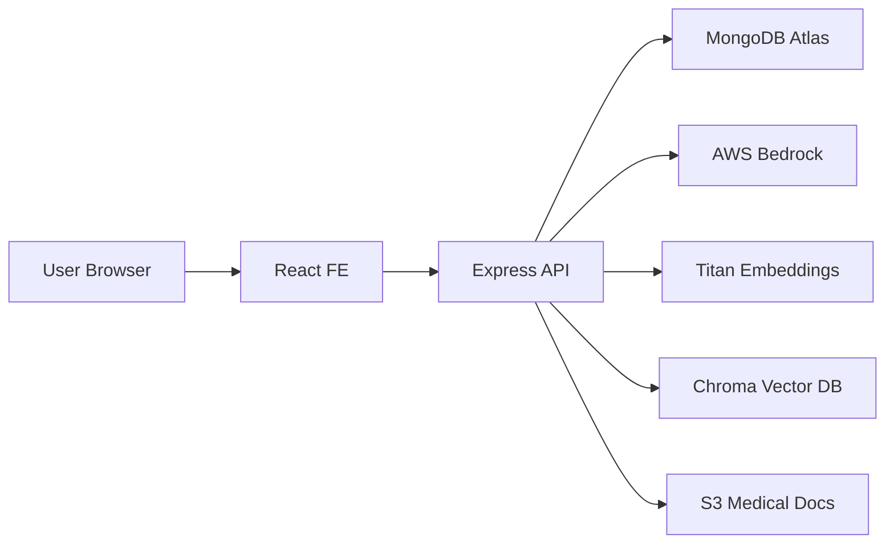

# TASK.md - Hi App Project Backlog

> Cập nhật: **19/05/2026**  
> Phạm vi: toàn bộ task hiện tại và tương lai của dự án, không giới hạn Week 2.  
> Cách chia: theo **chức năng sản phẩm**, trong mỗi chức năng tách rõ `BE`, `FE`, `QA`, `DevOps` nếu có.

---

## 1. Quy Ước

### Trạng Thái

| Ký hiệu | Ý nghĩa |
|---|---|
| [x] | Đã hoàn thành ở mức MVP hoặc đã có trong code |
| [ ] | Chưa hoàn thành |
| [~] | Đã có một phần, cần hoàn thiện |

### Mức Độ

| Mức | Ý nghĩa | Ước tính |
|---|---|---|
| S | Nhỏ, ít rủi ro, sửa 1-2 file | 1-2 giờ |
| M | Trung bình, một flow nhỏ BE hoặc FE | 0.5-1 ngày |
| L | Lớn, liên quan nhiều màn/API hoặc dữ liệu | 1-3 ngày |
| XL | Rất lớn, ảnh hưởng kiến trúc, bảo mật, AI, deploy | 3-7 ngày |

### Mốc Deadline Đề Xuất

| Mốc | Thời gian | Mục tiêu |
|---|---|---|
| MVP ổn định | 24/05/2026 | Auth, onboarding, cycle, symptoms, partner, chat, admin chạy ổn bằng API thật |
| Beta nội bộ | 31/05/2026 | Có quên mật khẩu, notification thật, test E2E cơ bản, privacy/consent |
| Staging production-like | 07/06/2026 | Deploy staging, monitoring/logging, CI/CD, security baseline |
| Production readiness | 14/06/2026 | Hoàn thiện bảo mật, backup, error tracking, tài liệu vận hành |
| Post-MVP | Sau 14/06/2026 | Push notification, advanced analytics, RAG admin, mobile app |

---

## 2. Tổng Quan Dự Án

**Hi App** là ứng dụng theo dõi sức khỏe sinh sản cho người dùng Việt Nam, hỗ trợ cả nữ và nam. Ứng dụng có:

- Đăng ký, đăng nhập, social auth.
- Onboarding theo giới tính.
- Dashboard nữ theo dõi chu kỳ, triệu chứng, AI chat.
- Dashboard nam theo dõi sức khỏe và hỗ trợ bạn đời.
- Kết nối bạn đời.
- Notification/reminder.
- Admin portal.
- AI chat tiếng Việt dùng RAG tài liệu y khoa.

---

## 3. Công Nghệ Đang Dùng

| Layer | Công nghệ | Ngôn ngữ | Ghi chú |
|---|---|---|---|
| Backend | Node.js, Express 4 | JavaScript CommonJS | Repo `BE/` |
| Database | MongoDB Atlas, Mongoose 8 | JavaScript schema | User, Cycle, Symptom, Chat, Notification |
| Auth | JWT, bcryptjs | JavaScript | Token-based auth |
| Frontend | React 18, Vite 5 | TypeScript, TSX | Repo `FE/` |
| Styling | Tailwind CSS 3 | CSS utility | Custom theme |
| State | Zustand, TanStack Query | TypeScript | Auth store + server state |
| Forms | React Hook Form, Zod | TypeScript | Đang dùng một phần |
| API client | Axios | TypeScript | `FE/src/lib/api.ts` |
| AI | AWS Bedrock Claude Haiku | JavaScript SDK | Chat response |
| Embedding | AWS Titan Embeddings | JavaScript SDK | RAG |
| Vector DB | Chroma | JavaScript client | Self-hosted |
| Shared types | `packages/shared` | TypeScript | Chưa dùng triệt để |
| Deploy | EC2, S3, CloudFront, Nginx, PM2 | Config/Shell | Có tài liệu, cần kiểm chứng |

---

## 4. Sơ Đồ Dự Án

---

## 5. Checklist Chức Năng Tổng

| Chức năng | BE | FE | Tổng trạng thái |
|---|---|---|---|
| Nền tảng dự án | [x] | [x] | [x] Root scripts/build/test đã chạy được |
| Đăng ký/đăng nhập | [x] | [x] | [x] MVP hoàn thành |
| Social auth Google/Facebook | [x] | [x] | [~] Cần hardening |
| Quên mật khẩu | [ ] | [ ] | [ ] Chưa làm |
| Onboarding | [~] | [x] | [~] Cần validation tốt hơn |
| Hồ sơ/cài đặt | [~] | [~] | [~] Có cơ bản, cần typed form |
| Tính chu kỳ | [~] | [~] | [~] CRUD có, cần validation/edit UX |
| Theo dõi triệu chứng | [~] | [~] | [~] Có list/create/delete, cần update/validation |
| Calendar | [x] | [~] | [~] Cần UX/error state tốt hơn |
| Dashboard nữ | [~] | [~] | [~] Dùng API thật, cần polish |
| Dashboard nam | [~] | [~] | [~] Dùng API thật, cần partner UX |
| Kết nối bạn đời | [~] | [~] | [~] Có API/UI, cần consent/privacy |
| AI Chat/RAG | [~] | [~] | [~] Có flow thật, cần guard/citation |
| Notification | [~] | [~] | [~] API có, generator chưa có |
| Admin portal | [~] | [~] | [~] Có dashboard, cần audit/export |
| Bảo mật/riêng tư | [~] | [ ] | [ ] Cần hoàn thiện trước production |
| Test tự động | [~] | [~] | [~] Smoke có, E2E sâu chưa có |
| Deploy/vận hành | [~] | [~] | [ ] Cần staging/CI/CD/monitoring |

---

## 6. Task Theo Chức Năng

### 6.1 Nền Tảng Dự Án, Config, Shared Types

**Khi hoàn thiện, flow đúng sẽ là:**

1. Dev clone project và chạy `npm install` ở root.
2. Root workspace nhận đúng `BE`, `FE`, `packages/shared`.
3. Dev chạy `npm run dev` để mở BE và FE cùng lúc.
4. Dev chạy `npm run build` để kiểm tra shared type, BE syntax và FE production build.
5. Dev chạy `npm run test:auto` để smoke test BE, FE, API, UI.
6. Shared types được import thống nhất vào FE, hạn chế type trùng lặp.
7. API contract được cập nhật khi BE đổi response hoặc endpoint.

| ID | Layer | Task | Status | Mức | Deadline | Mô tả | Hướng dẫn |
|---|---|---|---|---:|---|---|---|
| CORE-BE-01 | BE | Express server chạy được | [x] | S | Done | Server có route và middleware chính | Giữ `BE/src/index.js` đơn giản, route rõ |
| CORE-BE-02 | BE | MongoDB connection | [x] | S | Done | Kết nối MongoDB bằng Mongoose | Không hardcode connection string |
| CORE-FE-01 | FE | React + Vite + TypeScript | [x] | S | Done | FE build được bằng Vite | Giữ `vite.config.ts` đúng root/outDir |
| CORE-FE-02 | FE | Axios instance có token interceptor | [x] | S | Done | Tự gắn JWT vào request | Không redirect 401 trên auth endpoint |
| CORE-FE-03 | FE | TanStack Query provider | [x] | S | Done | Quản lý server state | Invalidate query sau mutation |
| CORE-FE-04 | FE | Zustand auth store persist | [x] | S | Done | Lưu user/token client-side | Cẩn thận khi logout/401 |
| CORE-FULL-01 | BE/FE | Sửa root workspace scripts | [x] | M | 20/05/2026 | Root `package.json` đã trỏ `BE`, `FE`, `packages/*`; root build chạy được | Duy trì `npm run build`, `npm run test:auto` trước khi push |
| CORE-FULL-02 | BE/FE | Chuẩn hóa response format | [~] | L | 22/05/2026 | Đã thêm response helper và chuẩn hóa auth response theo `{ success, message, data }`; các module khác còn cần migrate dần | Tiếp tục migrate cycles/symptoms/users/chat/admin sang cùng format |
| CORE-FULL-03 | BE/FE | Adopt shared types | [~] | L | 31/05/2026 | Đã cập nhật shared `User`, auth DTO/payload và FE dùng shared User/Auth types | Tiếp tục đưa Cycle/Symptom/Notification/Chat sang shared |
| CORE-DOC-01 | Docs | Cập nhật README chạy BE/FE | [ ] | S | 24/05/2026 | Dev mới cần chạy nhanh | Ghi env, install, dev, test |
| CORE-DOC-02 | Docs | Cập nhật API contract docs | [~] | M | 31/05/2026 | Đã có `API_CONTRACT.md` cho response format và auth endpoints | Bổ sung cycles/symptoms/users/chat/admin |

---

### 6.2 Đăng Ký, Đăng Nhập, Phân Quyền

**Khi hoàn thiện, flow đúng sẽ là:**

1. User mở `/register` hoặc `/login`.
2. FE validate email, password và form input trước khi gọi API.
3. FE gọi `POST /api/auth/register` hoặc `POST /api/auth/login`.
4. BE rate limit request auth theo IP/email.
5. BE validate input, hash/check password, xác định role theo `ADMIN_EMAILS`.
6. BE trả `{ success, message, data: { token, user } }`.
7. FE lưu token/user vào auth store, sau đó redirect theo `role`, `gender`, `onboardingCompleted`.
8. Route admin chỉ cho role `admin`; route user yêu cầu token và onboarding hợp lệ.
9. Khi token hết hạn, FE clear session, báo lỗi và đưa user về `/login?next=...`.

| ID | Layer | Task | Status | Mức | Deadline | Mô tả | Hướng dẫn |
|---|---|---|---|---:|---|---|---|
| AUTH-BE-01 | BE | API đăng ký email/password | [x] | M | Done | Tạo user, hash password, trả JWT | Không trả password hash |
| AUTH-BE-02 | BE | API đăng nhập email/password | [x] | M | Done | Kiểm tra password và trả token | Message lỗi tiếng Việt rõ |
| AUTH-BE-03 | BE | Middleware `protect` | [x] | S | Done | Chặn route cần đăng nhập | Thiếu/sai token trả `401` |
| AUTH-BE-04 | BE | Middleware `authorize('admin')` | [x] | S | Done | Chặn route admin | User thường trả `403` |
| AUTH-BE-05 | BE | Role admin theo `ADMIN_EMAILS` | [x] | S | Done | Gán role admin từ env | Normalize email lowercase |
| AUTH-FE-01 | FE | Login UI | [x] | M | Done | Form đăng nhập | Loading/error state cơ bản |
| AUTH-FE-02 | FE | Register UI | [x] | M | Done | Form đăng ký | Validate bằng form/schema |
| AUTH-FE-03 | FE | Route guard theo role/gender/onboarding | [x] | M | Done | Admin/female/male/onboarding routing | Giữ trong `App.tsx` |
| AUTH-BE-06 | BE | Validate email/password/gender chặt | [x] | M | 20/05/2026 | BE đã validate email format, password >= 8, gender enum | Duy trì rule đồng bộ với FE |
| AUTH-FE-04 | FE | Đồng bộ password policy UI | [x] | S | 20/05/2026 | Login/Register đều dùng password tối thiểu 8 ký tự | Message dưới input rõ |
| AUTH-BE-07 | BE | Rate limit login/register | [x] | L | 22/05/2026 | Đã có in-memory limiter cho login/register | Sau production có thể thay bằng Redis/shared store |
| AUTH-BE-08 | BE | Refresh token/session renewal | [~] | L | 31/05/2026 | Đã có endpoint `/api/auth/refresh` để làm mới JWT khi token còn hợp lệ; chưa có refresh token riêng | Thiết kế refresh token/httpOnly cookie nếu cần session dài hạn |
| AUTH-FE-05 | FE | UX expired session | [x] | M | 31/05/2026 | FE clear session, toast và redirect `/login?reason=session-expired&next=...` | Login giữ lại next path an toàn sau khi đăng nhập lại |
| AUTH-QA-01 | QA | Test auth happy/error path | [~] | L | 24/05/2026 | Smoke/static/build đã pass; live API bị skip nếu server chưa chạy | Cần thêm integration test với test DB cho register/login thật |

---

### 6.3 Social Auth Google/Facebook

**Khi hoàn thiện, flow đúng sẽ là:**

1. User bấm đăng nhập Google hoặc Facebook.
2. FE mở OAuth SDK/provider và nhận credential/access token.
3. FE gọi `POST /api/auth/google` hoặc `POST /api/auth/facebook`.
4. BE verify token với provider thật.
5. BE tìm user theo provider id hoặc email.
6. Nếu chưa có user, BE tạo user mới với `authProvider`.
7. Nếu user đã có email nhưng chưa link provider, BE gắn provider id vào user hiện tại.
8. BE trả token/user theo response auth chuẩn.
9. FE redirect theo role, onboarding và gender như login thường.

| ID | Layer | Task | Status | Mức | Deadline | Mô tả | Hướng dẫn |
|---|---|---|---|---:|---|---|---|
| SOCIAL-BE-01 | BE | Google auth controller | [x] | M | Done | Nhận credential/accessToken | Verify token bằng Google client |
| SOCIAL-BE-02 | BE | Facebook auth controller | [x] | M | Done | Nhận accessToken/userID | Gọi Graph API lấy profile |
| SOCIAL-FE-01 | FE | Google login button | [x] | M | Done | UI đăng nhập Google | Dùng env client id |
| SOCIAL-FE-02 | FE | Facebook login button | [x] | M | Done | UI đăng nhập Facebook | SDK load bằng env app id |
| SOCIAL-BE-03 | BE | Chuẩn hóa user thiếu email từ Facebook | [ ] | M | 24/05/2026 | Facebook có thể không trả email | Có rule rõ cho placeholder email và duplicate account |
| SOCIAL-FE-03 | FE | UX social auth fail | [ ] | S | 24/05/2026 | Người dùng thấy lỗi rõ | Toast lỗi, không crash popup |
| SOCIAL-QA-01 | QA | Test social auth config thiếu env | [ ] | M | 31/05/2026 | App không crash khi thiếu client id/app id | Mock env và render test |

---

### 6.4 Quên Mật Khẩu

**Khi hoàn thiện, flow đúng sẽ là:**

1. User bấm **Quên mật khẩu?**
2. FE mở `/forgot-password`, user nhập email.
3. FE gọi `POST /api/auth/forgot-password`.
4. BE luôn trả message chung để không lộ email có tồn tại hay không.
5. Nếu email tồn tại, BE tạo reset token, hash token rồi lưu vào DB cùng hạn dùng.
6. BE gửi link dạng `/reset-password/:token` qua email hoặc log dev-mode.
7. User mở link, nhập mật khẩu mới và xác nhận mật khẩu.
8. FE gọi `POST /api/auth/reset-password/:token`.
9. BE kiểm tra token hash, hạn dùng và password policy.
10. BE đổi password, xóa reset token và hạn dùng.
11. User đăng nhập lại bằng mật khẩu mới.

| ID | Layer | Task | Status | Mức | Deadline | Mô tả | Hướng dẫn |
|---|---|---|---|---:|---|---|---|
| FORGOT-BE-01 | BE | Thêm field reset password vào User | [ ] | M | 22/05/2026 | Lưu token hash và hạn dùng | Field: `passwordResetToken`, `passwordResetExpires` |
| FORGOT-BE-02 | BE | API yêu cầu quên mật khẩu | [ ] | M | 22/05/2026 | `POST /api/auth/forgot-password` | Nhận email, luôn trả message chung |
| FORGOT-BE-03 | BE | API đặt lại mật khẩu | [ ] | L | 23/05/2026 | `POST /api/auth/reset-password/:token` | Hash token, check expire, validate password |
| FORGOT-BE-04 | BE | Email reset password adapter | [ ] | L | 23/05/2026 | Gửi link reset qua email | Nếu chưa có provider, tạo adapter dev log trước |
| FORGOT-BE-05 | BE | Rate limit forgot/reset | [ ] | M | 23/05/2026 | Chống spam email/reset | Limit theo IP và email hash |
| FORGOT-FE-01 | FE | Giao diện quên mật khẩu | [ ] | M | 23/05/2026 | Trang `/forgot-password` nhập email | Link từ LoginPage |
| FORGOT-FE-02 | FE | Giao diện đặt lại mật khẩu | [ ] | M | 23/05/2026 | Trang `/reset-password/:token` | Validate password + confirm password |
| FORGOT-FE-03 | FE | UX bảo mật quên mật khẩu | [ ] | S | 23/05/2026 | Không tiết lộ email có tồn tại | Message chung: nếu email hợp lệ, hướng dẫn đã được gửi |
| FORGOT-QA-01 | QA | Test flow quên mật khẩu | [ ] | L | 24/05/2026 | Request reset, token sai, token hết hạn, reset thành công | Dùng test DB/token ngắn hạn |

---

### 6.5 Hồ Sơ Người Dùng, Settings, Onboarding

**Khi hoàn thiện, flow đúng sẽ là:**

1. User đăng ký hoặc đăng nhập lần đầu.
2. FE kiểm tra `onboardingCompleted`.
3. Nếu chưa hoàn thành, FE redirect user đến `/onboarding`.
4. User nhập thông tin cá nhân, giới tính, mục tiêu, chỉ số sức khỏe và dữ liệu chu kỳ ban đầu nếu có.
5. FE validate từng bước bằng schema rõ ràng.
6. FE gọi API cập nhật profile/onboarding.
7. BE whitelist field được phép update và chạy schema validators.
8. BE lưu profile, set `onboardingCompleted=true`.
9. FE cập nhật auth store bằng user mới.
10. FE redirect nữ đến `/female-dashboard`, nam đến `/male-dashboard`, admin đến `/admin`.

| ID | Layer | Task | Status | Mức | Deadline | Mô tả | Hướng dẫn |
|---|---|---|---|---:|---|---|---|
| PROFILE-BE-01 | BE | API lấy profile | [x] | S | Done | User đọc thông tin cá nhân | Protected route |
| PROFILE-BE-02 | BE | API cập nhật profile | [x] | M | Done | Update name, gender, health info | Cần validation thêm |
| PROFILE-FE-01 | FE | Onboarding nhiều bước | [x] | M | Done | Thu thập thông tin ban đầu | Redirect đúng sau submit |
| PROFILE-FE-02 | FE | Settings profile UI | [x] | M | Done | Người dùng chỉnh profile/cài đặt | Cần type chặt hơn |
| PROFILE-BE-03 | BE | Bật `runValidators` khi update profile | [ ] | S | 21/05/2026 | Update hiện có nguy cơ bỏ qua schema validation | `{ new: true, runValidators: true }` |
| PROFILE-BE-04 | BE | Whitelist field update profile | [ ] | M | 21/05/2026 | Chặn user tự update role/password trái phép | Pick field cho phép |
| PROFILE-BE-05 | BE | Validate tuổi, chiều cao, cân nặng | [ ] | M | 21/05/2026 | Chặn dữ liệu phi thực tế | Return `400` với message tiếng Việt |
| PROFILE-FE-03 | FE | Zod schema onboarding đầy đủ | [ ] | M | 22/05/2026 | Validate từng bước rõ | Tách schema theo gender nếu cần |
| PROFILE-FE-04 | FE | Inline error cho onboarding/settings | [ ] | M | 22/05/2026 | UX lỗi API rõ hơn | Không mất dữ liệu form khi fail |
| PROFILE-FE-05 | FE | Loại bỏ `any` trong settings forms | [ ] | M | 24/05/2026 | Type safety tốt hơn | Tạo `ProfileForm`, `NotificationSettingsForm` |
| PROFILE-QA-01 | QA | Test onboarding gender routing | [ ] | L | 24/05/2026 | Nữ -> female dashboard, nam -> male dashboard | E2E login + onboarding |

---

### 6.6 Tính Chu Kỳ

**Khi hoàn thiện, flow đúng sẽ là:**

1. User nữ hoàn thành onboarding hoặc mở trang chu kỳ.
2. Nếu onboarding có ngày kỳ kinh gần nhất, BE tạo cycle đầu tiên.
3. FE gọi `GET /api/cycles` để lấy danh sách chu kỳ.
4. User tạo chu kỳ mới hoặc chỉnh sửa chu kỳ hiện tại.
5. FE gọi `POST /api/cycles` hoặc `PUT /api/cycles/:id`.
6. BE validate `startDate`, `cycleLength`, `periodLength` và ownership.
7. BE lưu dữ liệu chu kỳ theo user.
8. BE/FE tính ngày hiện tại trong chu kỳ, kỳ kinh tiếp theo, cửa sổ rụng trứng và fertility window.
9. FE hiển thị dữ liệu trên dashboard, calendar và CyclesPage.
10. User có thể xóa chu kỳ, FE gọi `DELETE /api/cycles/:id` sau khi confirm.

| ID | Layer | Task | Status | Mức | Deadline | Mô tả | Hướng dẫn |
|---|---|---|---|---:|---|---|---|
| CYCLE-BE-01 | BE | Cycle model | [x] | M | Done | Lưu chu kỳ theo user | Field chính: startDate, cycleLength, periodLength |
| CYCLE-BE-02 | BE | API list/create/update/delete cycle | [x] | M | Done | CRUD `/api/cycles` | Ownership theo user |
| CYCLE-FE-01 | FE | Dashboard nữ đọc cycle thật | [x] | M | Done | Không còn fake cycle | Query `/cycles` |
| CYCLE-FE-02 | FE | Dashboard nữ lưu cycle thật | [x] | M | Done | Panel cycle gọi API | Invalidate `['cycles']` |
| CYCLE-FE-03 | FE | Calendar/CyclesPage đọc API thật | [x] | M | Done | Không dùng fake data | Empty/loading state cơ bản |
| CYCLE-BE-03 | BE | Validate `startDate` không ở tương lai | [ ] | S | 21/05/2026 | Chặn ngày không hợp lệ | Validate create/update |
| CYCLE-BE-04 | BE | Validate `cycleLength` 21-35 | [ ] | S | 21/05/2026 | Rule phổ biến cho chu kỳ | Cho phép config sau nếu cần |
| CYCLE-BE-05 | BE | Validate `periodLength` 2-7 | [ ] | S | 21/05/2026 | Rule phổ biến cho kỳ kinh | Return `400` nếu sai |
| CYCLE-BE-06 | BE | Tạo cycle từ onboarding | [ ] | M | 22/05/2026 | Nếu có `lastPeriodDate`, tạo cycle đầu tiên | Chỉ tạo nếu user chưa có cycle |
| CYCLE-BE-07 | BE | API dự đoán ngày kỳ kinh tiếp theo | [ ] | M | 31/05/2026 | Tính next period/ovulation/fertility window | Có thể trả trong cycle summary endpoint |
| CYCLE-FE-04 | FE | Giao diện sửa/xóa cycle đầy đủ | [ ] | L | 22/05/2026 | CyclesPage cần edit/delete thật | Modal edit, confirm delete |
| CYCLE-FE-05 | FE | Calendar hiển thị period/fertile/ovulation | [ ] | L | 31/05/2026 | Visual hóa ngày quan trọng | Dùng data từ API hoặc helper FE |
| CYCLE-FE-06 | FE | Empty/error/loading state cycle | [ ] | M | 22/05/2026 | Không crash khi API lỗi/rỗng | Retry, toast, skeleton |
| CYCLE-QA-01 | QA | Test flow tính chu kỳ | [ ] | L | 24/05/2026 | Tạo/sửa/xóa, validation fail, ownership | API + FE E2E |

---

### 6.7 Theo Dõi Triệu Chứng

**Khi hoàn thiện, flow đúng sẽ là:**

1. User mở SymptomsPage hoặc panel triệu chứng ở dashboard nữ.
2. FE gọi `GET /api/symptoms` để lấy triệu chứng đã ghi.
3. User chọn triệu chứng, mức độ, ngày và ghi chú.
4. FE validate input và gọi `POST /api/symptoms`.
5. BE validate name, severity, date và ownership.
6. BE lưu symptom theo user, ngày và cycle liên quan nếu xác định được.
7. FE invalidate query và cập nhật thống kê triệu chứng.
8. User có thể sửa symptom, FE gọi `PUT /api/symptoms/:id`.
9. User có thể xóa symptom, FE gọi `DELETE /api/symptoms/:id` sau khi confirm.
10. Dashboard/CyclesPage dùng dữ liệu symptom thật để thống kê.

| ID | Layer | Task | Status | Mức | Deadline | Mô tả | Hướng dẫn |
|---|---|---|---|---:|---|---|---|
| SYMPTOM-BE-01 | BE | Symptom model | [x] | M | Done | Lưu symptom theo user | Field: name, severity, date, notes |
| SYMPTOM-BE-02 | BE | API list/create/delete symptom | [x] | M | Done | Route `/api/symptoms` | Protected route |
| SYMPTOM-FE-01 | FE | SymptomsPage dùng API thật | [x] | M | Done | Không còn fake data | Query/mutation thật |
| SYMPTOM-FE-02 | FE | Dashboard nữ lưu symptom thật | [x] | M | Done | Panel triệu chứng gọi `/symptoms` | Invalidate `['symptoms']` |
| SYMPTOM-FE-03 | FE | CyclesPage thống kê symptom từ API | [x] | M | Done | Dùng dữ liệu thật | Không hardcode stats |
| SYMPTOM-BE-03 | BE | API update symptom | [ ] | M | 22/05/2026 | Cho phép chỉnh symptom | `PUT /api/symptoms/:id` |
| SYMPTOM-BE-04 | BE | Validate severity/date/name | [ ] | M | 22/05/2026 | Chặn name rỗng, date tương lai, severity sai | Validate create/update |
| SYMPTOM-BE-05 | BE | Gắn symptom với cycle/date rõ ràng | [ ] | L | 31/05/2026 | Thống kê theo chu kỳ chính xác hơn | Lưu `cycleId` hoặc tính theo date |
| SYMPTOM-FE-04 | FE | Giao diện sửa symptom | [ ] | M | 24/05/2026 | Edit severity/note/date | Modal hoặc inline edit |
| SYMPTOM-FE-05 | FE | UX triệu chứng mobile | [ ] | M | 24/05/2026 | Form dễ dùng trên điện thoại | Chọn icon, slider severity, note |
| SYMPTOM-QA-01 | QA | Test flow symptom | [ ] | L | 24/05/2026 | Create/update/delete, empty/error state | API + FE E2E |

---

### 6.8 Dashboard Nữ

**Khi hoàn thiện, flow đúng sẽ là:**

1. User nữ đăng nhập và đã hoàn thành onboarding.
2. FE mở `/female-dashboard`.
3. FE gọi API lấy profile, cycles, symptoms, notifications và chat history cần thiết.
4. Dashboard hiển thị pha chu kỳ, ngày chu kỳ, dự đoán kỳ kinh, triệu chứng và gợi ý chăm sóc.
5. User mở panel cycle để cập nhật kỳ kinh, FE gọi API cycle thật.
6. User mở panel symptoms để lưu triệu chứng, FE gọi API symptoms thật.
7. User gửi câu hỏi trong AI chat, FE gọi `POST /api/chat`.
8. Nếu dữ liệu rỗng hoặc API lỗi, FE hiển thị empty/error state rõ và không dùng fake data.
9. UI hoạt động tốt trên mobile, tablet và desktop.

| ID | Layer | Task | Status | Mức | Deadline | Mô tả | Hướng dẫn |
|---|---|---|---|---:|---|---|---|
| FDASH-FE-01 | FE | Dashboard nữ dùng API cycle thật | [x] | M | Done | Hiển thị phase/day từ cycle | Dùng query `/cycles` |
| FDASH-FE-02 | FE | Dashboard nữ lưu cycle thật | [x] | M | Done | Panel cycle mutation API | Có success state |
| FDASH-FE-03 | FE | Dashboard nữ lưu symptom thật | [x] | M | Done | Panel symptom mutation API | Có toast lỗi |
| FDASH-FE-04 | FE | Dashboard nữ chat API thật | [x] | M | Done | Không còn reply fake | Mutation `/chat` |
| FDASH-FE-05 | FE | Empty state khi chưa có cycle | [ ] | M | 22/05/2026 | User mới phải thấy hướng dẫn tạo cycle | CTA mở panel tạo cycle |
| FDASH-FE-06 | FE | Responsive dashboard nữ | [ ] | M | 24/05/2026 | Mobile/tablet không overlap | Test 375px, 768px, desktop |
| FDASH-FE-07 | FE | Tối ưu layout cards/charts | [ ] | M | 31/05/2026 | UI polish sau MVP | Giảm text dài, ổn định height |
| FDASH-QA-01 | QA | Test dashboard nữ end-to-end | [ ] | L | 24/05/2026 | Login nữ -> cycle -> symptom -> chat | E2E hoặc manual regression |

---

### 6.9 Dashboard Nam

**Khi hoàn thiện, flow đúng sẽ là:**

1. User nam đăng nhập và đã hoàn thành onboarding.
2. FE mở `/male-dashboard`.
3. FE lấy profile và kiểm tra trạng thái kết nối partner.
4. Nếu chưa kết nối, dashboard hiển thị CTA nhập mã partner.
5. Nếu đã kết nối, FE gọi API lấy chu kỳ partner được chia sẻ.
6. Dashboard hiển thị thông tin hỗ trợ partner theo chu kỳ thật.
7. User có thể gửi câu hỏi AI, FE gọi API chat thật.
8. Khi phát triển health check-in nam, FE lấy/lưu dữ liệu sức khỏe nam qua API riêng.
9. UI có empty/error/loading state và không dùng dữ liệu giả.

| ID | Layer | Task | Status | Mức | Deadline | Mô tả | Hướng dẫn |
|---|---|---|---|---:|---|---|---|
| MDASH-FE-01 | FE | Dashboard nam dùng API thật | [x] | M | Done | Không còn fake partner/chat data | Query profile, partner cycles, chat |
| MDASH-FE-02 | FE | Hiển thị trạng thái chưa kết nối partner | [x] | M | Done | Không dùng dữ liệu giả | Empty state rõ |
| MDASH-FE-03 | FE | Chat dashboard nam gọi API thật | [x] | M | Done | Mutation `/chat` | Không setTimeout fake |
| MDASH-BE-01 | BE | API summary sức khỏe nam | [ ] | L | 31/05/2026 | Hiện dashboard nam hiện còn thiên về partner | Thiết kế model/check-in nếu cần |
| MDASH-FE-04 | FE | Giao diện health check-in cho nam | [ ] | L | 31/05/2026 | Theo dõi mood, sleep, libido, exercise | Cần BE contract trước |
| MDASH-FE-05 | FE | Responsive dashboard nam | [ ] | M | 24/05/2026 | Mobile/tablet không overlap | Test viewport nhỏ |
| MDASH-QA-01 | QA | Test dashboard nam end-to-end | [ ] | L | 24/05/2026 | Login nam -> connect partner -> xem cycles -> chat | Dùng 2 account test |

---

### 6.10 Kết Nối Bạn Đời

**Khi hoàn thiện, flow đúng sẽ là:**

1. Mỗi user có `partnerCode` riêng trong profile.
2. User mở Settings hoặc dashboard và nhập mã partner.
3. FE hiển thị modal consent, giải thích dữ liệu sẽ được chia sẻ.
4. User xác nhận đồng ý chia sẻ.
5. FE gọi `POST /api/users/connect-partner`.
6. BE kiểm tra mã partner tồn tại, không phải chính user hiện tại và chưa vi phạm rule kết nối.
7. BE lưu liên kết hai chiều giữa hai user.
8. BE tạo notification cho hai bên.
9. FE refresh profile và hiển thị trạng thái đã kết nối.
10. Partner chỉ xem được dữ liệu được cho phép, ví dụ cycle summary.
11. Khi user hủy kết nối, FE gọi `DELETE /api/users/disconnect-partner`, BE xóa liên kết hai chiều.

| ID | Layer | Task | Status | Mức | Deadline | Mô tả | Hướng dẫn |
|---|---|---|---|---:|---|---|---|
| PARTNER-BE-01 | BE | User có `partnerCode` | [x] | S | Done | Mã kết nối partner | Đảm bảo unique |
| PARTNER-BE-02 | BE | API connect partner | [x] | M | Done | Kết nối bằng partner code | Không cho tự connect |
| PARTNER-BE-03 | BE | API disconnect partner | [x] | M | Done | Hủy kết nối hai chiều | Update cả hai user |
| PARTNER-BE-04 | BE | API get partner cycles | [x] | M | Done | Xem chu kỳ partner đã kết nối | Chỉ trả khi có quyền |
| PARTNER-FE-01 | FE | Giao diện nhập mã kết nối | [x] | M | Done | Connect partner từ settings/dashboard | Refresh profile sau mutate |
| PARTNER-FE-02 | FE | Giao diện hủy kết nối | [x] | M | Done | Disconnect gọi API thật | Refresh profile sau mutate |
| PARTNER-FE-03 | FE | Male dashboard đọc partner cycles | [x] | M | Done | Route đúng `/users/partner-cycles` | Empty state khi chưa có partner |
| PARTNER-BE-05 | BE | Partner cycles trả partner profile | [ ] | S | 22/05/2026 | FE cần name/gender/avatar tối thiểu | Response `{ partner, cycles }` |
| PARTNER-BE-06 | BE | Quyền xem dữ liệu partner chặt hơn | [ ] | M | 23/05/2026 | Tránh leak dữ liệu user khác | Test mismatch partner/user |
| PARTNER-BE-07 | BE | Partner consent version | [ ] | L | 31/05/2026 | Lưu user đã đồng ý chia sẻ gì | Field consent timestamp/version |
| PARTNER-FE-04 | FE | Modal xác nhận connect/disconnect | [ ] | M | 23/05/2026 | Tránh thao tác nhầm | Hiển thị dữ liệu sẽ chia sẻ |
| PARTNER-FE-05 | FE | Giao diện privacy consent partner | [ ] | M | 23/05/2026 | Người dùng chủ động đồng ý | Checkbox bắt buộc trước connect |
| PARTNER-BE-08 | BE | Notification khi connect/disconnect | [ ] | L | 24/05/2026 | Hai bên nhận thông báo | Gọi notification service |
| PARTNER-QA-01 | QA | Test flow kết nối bạn đời | [ ] | L | 24/05/2026 | Connect, xem dữ liệu, disconnect, kiểm tra quyền | Dùng 2 user test |

---

### 6.11 AI Chat Và RAG

**Khi hoàn thiện, flow đúng sẽ là:**

1. User mở ChatPage hoặc chat panel trên dashboard.
2. FE gọi `GET /api/chat` để lấy lịch sử chat.
3. User nhập câu hỏi sức khỏe sinh sản.
4. FE validate nội dung không rỗng và gọi `POST /api/chat` với `{ content }`.
5. BE kiểm tra auth, rate limit, prompt length và daily quota.
6. BE gọi RAG retrieve để lấy tài liệu liên quan từ Chroma.
7. BE dựng prompt an toàn với disclaimer y tế và context RAG.
8. BE gọi AWS Bedrock để sinh câu trả lời.
9. BE lưu user message, assistant message và source/citation nếu có.
10. FE hiển thị câu trả lời, citation, loading/error state và medical disclaimer.
11. Nếu Bedrock/Chroma lỗi, BE trả friendly error, FE không crash và cho user thử lại.

| ID | Layer | Task | Status | Mức | Deadline | Mô tả | Hướng dẫn |
|---|---|---|---|---:|---|---|---|
| CHAT-BE-01 | BE | Chat model | [x] | M | Done | Lưu message user/assistant | Ownership theo user |
| CHAT-BE-02 | BE | API chat history | [x] | M | Done | `GET /api/chat` | Protected route |
| CHAT-BE-03 | BE | API send message | [x] | L | Done | `POST /api/chat` gọi Bedrock | Body `{ content }` |
| CHAT-BE-04 | BE | RAG retrieve từ Chroma | [x] | L | Done | Lấy tài liệu liên quan | Có fallback khi cần |
| CHAT-BE-05 | BE | RAG ingest từ S3 | [x] | L | Done | Ingest tài liệu y khoa | Script riêng |
| CHAT-FE-01 | FE | ChatPage gọi API thật | [x] | M | Done | Không dùng route cũ | `GET /chat`, `POST /chat` |
| CHAT-FE-02 | FE | Dashboard chat gọi API thật | [x] | M | Done | Không reply fake | Mutation `/chat` |
| CHAT-BE-06 | BE | Rate limit chat | [ ] | L | 24/05/2026 | Kiểm soát spam/cost | Limit theo user/ngày và IP |
| CHAT-BE-07 | BE | Giới hạn prompt length/token | [ ] | M | 24/05/2026 | Tránh prompt quá dài | Trim content, max length |
| CHAT-BE-08 | BE | Friendly error khi Bedrock/Chroma lỗi | [ ] | M | 24/05/2026 | Không leak stack/provider error | Message an toàn bằng tiếng Việt |
| CHAT-BE-09 | BE | Lưu source/citation metadata | [ ] | XL | 31/05/2026 | Chat response có nguồn tham khảo | Retrieve trả metadata, Chat lưu `sources` |
| CHAT-BE-10 | BE | Medical safety prompt | [ ] | L | 31/05/2026 | AI không chẩn đoán thay bác sĩ | System prompt, emergency disclaimer |
| CHAT-FE-03 | FE | UI loading/error chat tốt hơn | [ ] | M | 24/05/2026 | Disable input khi pending, retry/toast | Giữ message user khi fail |
| CHAT-FE-04 | FE | Hiển thị medical disclaimer | [ ] | S | 24/05/2026 | Nhắc chỉ tham khảo | ChatPage và dashboard panel |
| CHAT-FE-05 | FE | Hiển thị citation/source | [ ] | L | 31/05/2026 | Cho user xem nguồn RAG | Cần BE sources trước |
| CHAT-QA-01 | QA | Test chat happy/error path | [ ] | L | 31/05/2026 | Prompt rỗng/quá dài, provider lỗi, history theo user | Mock provider nếu cần |

---

### 6.12 Notification Và Reminder

**Khi hoàn thiện, flow đúng sẽ là:**

1. User bật/tắt loại thông báo trong Settings.
2. BE lưu notification preferences theo user.
3. Khi có sự kiện như sắp tới kỳ kinh, partner connect/disconnect hoặc admin/system event, BE tạo notification.
4. Cron/job hoặc service thủ công chạy generator reminder định kỳ.
5. FE gọi `GET /api/notifications` để lấy danh sách thông báo.
6. Navbar/sidebar hiển thị unread count thật.
7. User mở notification, FE gọi mark read.
8. User bấm mark all read, FE gọi API mark all.
9. BE đảm bảo user chỉ đọc/cập nhật notification của chính mình.

| ID | Layer | Task | Status | Mức | Deadline | Mô tả | Hướng dẫn |
|---|---|---|---|---:|---|---|---|
| NOTI-BE-01 | BE | Notification model | [x] | M | Done | Lưu notification theo user | Fields title/message/read/type |
| NOTI-BE-02 | BE | API list notification | [x] | M | Done | `GET /api/notifications` | Protected route |
| NOTI-BE-03 | BE | API mark one/all read | [x] | M | Done | Update read status | Không update user khác |
| NOTI-FE-01 | FE | NotificationsPage gọi API thật | [x] | M | Done | List/mark read | Loading/empty cơ bản |
| NOTI-FE-02 | FE | Notification settings UI | [~] | M | 24/05/2026 | Có giao diện, cần lưu áp dụng thật | Cần BE settings contract |
| NOTI-BE-04 | BE | Notification generator kỳ kinh | [ ] | L | 24/05/2026 | Tạo reminder trước kỳ kinh | Service chạy thủ công trước, cron sau |
| NOTI-BE-05 | BE | Notification cho partner | [ ] | L | 24/05/2026 | Connect/disconnect/chu kỳ partner | Gọi từ partner/cycle service |
| NOTI-BE-06 | BE | Notification settings schema | [ ] | M | 31/05/2026 | Lưu loại thông báo user bật/tắt | Trong User hoặc model riêng |
| NOTI-FE-03 | FE | Badge unread count | [ ] | M | 24/05/2026 | Navbar/sidebar hiển thị số chưa đọc | Count `read=false`, invalidate khi mark read |
| NOTI-FE-04 | FE | Giao diện reminder preferences | [ ] | M | 31/05/2026 | Chọn nhắc trước bao nhiêu ngày | Cần BE schema |
| NOTI-QA-01 | QA | Test notification end-to-end | [ ] | L | 31/05/2026 | Sinh notification, xem, mark read, settings | API + FE |

---

### 6.13 Admin Portal

**Khi hoàn thiện, flow đúng sẽ là:**

1. Admin đăng nhập bằng email nằm trong `ADMIN_EMAILS` hoặc role admin.
2. FE route guard đưa admin vào `/admin`.
3. FE gọi API overview để lấy thống kê user, cycle, chat, notification và vận hành.
4. Admin xem danh sách user có search/filter/pagination.
5. Admin đổi role user sau khi xác nhận trong modal.
6. BE kiểm tra admin permission, validate role và chặn thao tác nguy hiểm.
7. BE lưu audit log cho hành động admin.
8. FE refresh bảng user và hiển thị toast kết quả.
9. Admin có thể export report nếu cần.
10. User thường hoặc request thiếu token không xem được dữ liệu admin.

| ID | Layer | Task | Status | Mức | Deadline | Mô tả | Hướng dẫn |
|---|---|---|---|---:|---|---|---|
| ADMIN-BE-01 | BE | Admin route protected | [x] | M | Done | `protect + authorize('admin')` | User thường không được vào |
| ADMIN-BE-02 | BE | Admin overview stats | [x] | M | Done | Thống kê tổng quan | Không query quá nặng |
| ADMIN-BE-03 | BE | Admin users list | [x] | M | Done | Danh sách user | Không trả password |
| ADMIN-BE-04 | BE | Admin update role | [x] | M | Done | Đổi role user/admin | Validate role |
| ADMIN-FE-01 | FE | Admin dashboard UI | [x] | L | Done | Trang admin có charts/table | Guard route |
| ADMIN-BE-05 | BE | Audit log đổi role | [ ] | L | 31/05/2026 | Lưu admin nào đổi role ai | Model AuditLog hoặc Notification admin |
| ADMIN-BE-06 | BE | Chặn thao tác admin nguy hiểm | [ ] | M | 31/05/2026 | Không tự hạ quyền hoặc thao tác thiếu confirm | Validate target/action |
| ADMIN-BE-07 | BE | Server-side filter/search/pagination users | [ ] | L | 31/05/2026 | Admin list lớn cần phân trang | Query params: page, limit, search, role |
| ADMIN-FE-02 | FE | Confirm khi đổi role | [ ] | M | 31/05/2026 | Tránh click nhầm | Modal confirm |
| ADMIN-FE-03 | FE | Users table filter/search/pagination | [ ] | L | 31/05/2026 | Tìm user nhanh | Đồng bộ với API |
| ADMIN-FE-04 | FE | Export report CSV | [ ] | L | 07/06/2026 | Xuất báo cáo admin | FE CSV hoặc BE endpoint |
| ADMIN-QA-01 | QA | Test phân quyền admin | [ ] | L | 31/05/2026 | Không token/user/admin | API + FE route guard |

---

### 6.14 Bảo Mật, Riêng Tư, Compliance

**Khi hoàn thiện, flow đúng sẽ là:**

1. User được xem privacy/consent screen trong onboarding hoặc settings.
2. User đồng ý điều khoản xử lý dữ liệu sức khỏe trước khi dùng các flow nhạy cảm.
3. BE chỉ nhận field đã whitelist và sanitize request body.
4. BE kiểm tra auth, role và ownership ở mọi endpoint nhạy cảm.
5. BE không log dữ liệu sức khỏe nhạy cảm, token hoặc password.
6. Production error không trả stack trace cho client.
7. User có thể yêu cầu export dữ liệu cá nhân.
8. User có thể yêu cầu xóa tài khoản theo chính sách.
9. Security checklist được chạy trước staging/production deploy.

| ID | Layer | Task | Status | Mức | Deadline | Mô tả | Hướng dẫn |
|---|---|---|---|---:|---|---|---|
| SEC-BE-01 | BE | Helmet enabled | [x] | S | Done | Header bảo mật cơ bản | Giữ config tương thích OAuth |
| SEC-BE-02 | BE | CORS whitelist | [x] | S | Done | Cho origin hợp lệ | Cập nhật staging/prod |
| SEC-BE-03 | BE | Password không trả qua JSON | [x] | S | Done | Không leak password hash | Kiểm tra User schema |
| SEC-BE-04 | BE | Sanitize request body chống NoSQL injection | [ ] | L | 24/05/2026 | Chặn `$ne`, `$gt`, object injection | Middleware sanitize hoặc whitelist body |
| SEC-BE-05 | BE | Production error không leak stack | [ ] | M | 24/05/2026 | Response lỗi an toàn | Dựa vào `NODE_ENV` |
| SEC-BE-06 | BE | Rate limit auth/chat/forgot | [ ] | L | 24/05/2026 | Chống spam/cost | Có limiter chung |
| SEC-BE-07 | BE | Audit log security events | [ ] | L | 07/06/2026 | Login fail nhiều, đổi role, reset password | Log không chứa dữ liệu nhạy cảm |
| SEC-FE-01 | FE | Privacy/consent screen | [ ] | L | 31/05/2026 | Đồng ý xử lý dữ liệu sức khỏe | Hiển thị trong onboarding/settings |
| SEC-FE-02 | FE | Partner privacy consent UI | [ ] | M | 24/05/2026 | Đồng ý chia sẻ dữ liệu với partner | Checkbox + modal |
| SEC-FULL-01 | BE/FE | Delete account | [ ] | XL | 14/06/2026 | Người dùng xóa tài khoản | Soft delete hoặc hard delete theo chính sách |
| SEC-FULL-02 | BE/FE | Export personal data | [ ] | XL | 14/06/2026 | Người dùng xuất dữ liệu cá nhân | JSON/CSV export |
| SEC-QA-01 | QA | Security review trước deploy | [ ] | L | 07/06/2026 | Auth, role, CORS, env, logs, data leak | Theo checklist reviewer |

---

### 6.15 Testing, QA, Automation

**Khi hoàn thiện, flow đúng sẽ là:**

1. Dev sửa code BE/FE.
2. Dev chạy `npm run test:auto` ở root.
3. Runner kiểm tra shared type, BE syntax, FE lint/build, fake data scan, UI/API smoke.
4. Nếu BE/FE dev server đang chạy, runner kiểm tra live API/UI.
5. CI chạy cùng test khi push lên `develop` hoặc mở pull request.
6. Playwright chạy E2E các flow chính: auth, onboarding, cycle, symptom, partner, chat, admin.
7. Accessibility và responsive smoke test kiểm tra mobile/tablet/desktop.
8. Kết quả test được ghi vào báo cáo trước demo/deploy.

| ID | Layer | Task | Status | Mức | Deadline | Mô tả | Hướng dẫn |
|---|---|---|---|---:|---|---|---|
| TEST-FULL-01 | QA | Smoke runner tự động | [x] | M | Done | `npm run test:auto` kiểm tra BE/FE/API/UI smoke | File `scripts/automated-test-runner.mjs` |
| TEST-BE-01 | QA | BE syntax check | [x] | S | Done | `node --check` BE JS files | Trong smoke runner |
| TEST-FE-01 | QA | FE lint/build | [x] | S | Done | ESLint + Vite build | Trong smoke runner |
| TEST-API-01 | QA | API live smoke | [x] | M | Done | Health, auth guard, validation cơ bản | Trong smoke runner |
| TEST-UI-01 | QA | UI live smoke | [x] | M | Done | Fetch route app shell | Trong smoke runner |
| TEST-BE-02 | QA | API integration tests | [ ] | L | 31/05/2026 | Auth, profile, cycles, symptoms, chat, partner | Dùng test DB |
| TEST-FE-02 | QA | Playwright E2E smoke | [ ] | L | 31/05/2026 | Login, onboarding, dashboard, cycle, symptom | Cài `@playwright/test` |
| TEST-FE-03 | QA | Accessibility smoke | [ ] | M | 07/06/2026 | aria, label, keyboard, contrast cơ bản | Dùng axe/playwright |
| TEST-FE-04 | QA | Responsive regression | [ ] | M | 07/06/2026 | 375px, 768px, desktop | Screenshot/manual checklist |
| TEST-FULL-02 | QA | No fake data scan mở rộng | [x] | S | Done | Scan runtime source | Duy trì marker scan |
| TEST-FULL-03 | QA | Test report template | [ ] | S | 24/05/2026 | Mỗi lần demo có biên bản test | Ghi pass/fail/blocker |

---

### 6.16 Deploy, DevOps, Monitoring

**Khi hoàn thiện, flow đúng sẽ là:**

1. Dev push code lên `develop`.
2. CI chạy lint/build/test tự động.
3. Nếu pass, staging deploy được kích hoạt.
4. BE chạy trên EC2 bằng PM2 hoặc service tương đương.
5. Nginx reverse proxy API và cấu hình CORS/domain đúng.
6. FE build static được deploy lên S3/CloudFront hoặc hosting tương đương.
7. Chroma service chạy ổn định và tự restart sau reboot.
8. Health check, logs và alert theo dõi BE/FE/Chroma.
9. MongoDB backup plan được bật và kiểm tra định kỳ.
10. Production deploy chỉ thực hiện khi staging smoke test pass.

| ID | Layer | Task | Status | Mức | Deadline | Mô tả | Hướng dẫn |
|---|---|---|---|---:|---|---|---|
| OPS-BE-01 | BE | Health check endpoint | [x] | S | Done | `/health` trả API status | Dùng cho monitor |
| OPS-FE-01 | FE | FE production build pass | [x] | S | Done | Vite build thành công | Theo smoke runner |
| OPS-BE-02 | DevOps | BE `.env.example` đầy đủ | [~] | M | 24/05/2026 | Liệt kê biến required | Không hardcode secret |
| OPS-FE-02 | DevOps | FE `.env.example` đầy đủ | [x] | S | Done | API URL, Google/Facebook env | Duy trì khi thêm env |
| OPS-DEV-01 | DevOps | PM2 config cho BE | [ ] | M | 07/06/2026 | Chạy BE ổn trên EC2 | ecosystem file, restart policy |
| OPS-DEV-02 | DevOps | Nginx reverse proxy config | [ ] | M | 07/06/2026 | Proxy API, gzip, headers | Kiểm chứng staging |
| OPS-DEV-03 | DevOps | S3/CloudFront FE deploy | [ ] | L | 07/06/2026 | Deploy FE static | Cache invalidation |
| OPS-DEV-04 | DevOps | Chroma service setup | [ ] | L | 07/06/2026 | Vector DB chạy sau reboot | systemd/docker compose |
| OPS-DEV-05 | DevOps | CI/CD develop/main | [ ] | XL | 14/06/2026 | Test/build/deploy tự động | GitHub Actions hoặc deploy script |
| OPS-DEV-06 | DevOps | Logging/monitoring production | [ ] | L | 14/06/2026 | Logs, errors, health alerts | PM2 logs + external monitoring |
| OPS-DEV-07 | DevOps | Backup MongoDB plan | [ ] | L | 14/06/2026 | Bảo vệ dữ liệu sức khỏe | Atlas backup/export policy |

---

### 6.17 Documentation, Product, Handoff

**Khi hoàn thiện, flow đúng sẽ là:**

1. Khi thêm hoặc đổi chức năng, dev cập nhật `TASK.md`.
2. Khi đổi endpoint/response, dev cập nhật `API_CONTRACT.md`.
3. Khi đổi cách chạy/deploy, dev cập nhật README hoặc deploy runbook.
4. Product flow chính được mô tả bằng Mermaid hoặc checklist.
5. Admin guide mô tả cách quản lý user, role, report.
6. Privacy/disclaimer copy được viết rõ và dùng lại trong FE.
7. Người mới vào dự án có thể đọc docs để chạy, test, deploy và hiểu backlog.

| ID | Layer | Task | Status | Mức | Deadline | Mô tả | Hướng dẫn |
|---|---|---|---|---:|---|---|---|
| DOC-01 | Docs | Product feature list | [x] | M | Done | Có checklist chức năng | Duy trì trong `TASK.md` |
| DOC-02 | Docs | API endpoint docs | [ ] | M | 31/05/2026 | BE/FE thống nhất contract | Markdown hoặc OpenAPI đơn giản |
| DOC-03 | Docs | User flow docs | [ ] | M | 31/05/2026 | Auth, onboarding, cycle, partner, chat | Mermaid flow |
| DOC-04 | Docs | Admin guide | [ ] | S | 07/06/2026 | Hướng dẫn dùng admin portal | Role, đổi role, export |
| DOC-05 | Docs | Deploy runbook | [ ] | L | 07/06/2026 | Cách deploy/restart/debug | EC2, Nginx, PM2, Chroma |
| DOC-06 | Docs | Privacy and medical disclaimer copy | [ ] | M | 31/05/2026 | Nội dung hiển thị cho user | Duyệt kỹ ngôn ngữ y tế |

---

## 7. Ưu Tiên Thực Hiện Gần Nhất

### P0 - Cần Làm Ngay Trước Demo MVP

| Task | Lý do |
|---|---|
| AUTH-BE-06 + AUTH-FE-04 | Auth validation phải đồng bộ |
| CYCLE-BE-03/04/05 + CYCLE-FE-04 | Tính chu kỳ là core feature |
| SYMPTOM-BE-03/04 + SYMPTOM-FE-04 | Triệu chứng cần update/validation |
| FORGOT-BE-01/02/03 + FORGOT-FE-01/02 | Quên mật khẩu là flow auth quan trọng |
| PARTNER-FE-04/05 + PARTNER-BE-06 | Dữ liệu partner nhạy cảm, cần consent/quyền rõ |
| CHAT-BE-06/07/08 + CHAT-FE-03/04 | AI chat cần guard chi phí và lỗi an toàn |
| NOTI-BE-04 + NOTI-FE-03 | Notification cần có giá trị thật |
| SEC-BE-04/05/06 | Bảo mật baseline trước khi demo rộng |

### P1 - Sau Khi MVP Chạy Ổn

| Task | Lý do |
|---|---|
| CORE-FULL-02 | Chuẩn hóa response format giúp dự án dễ scale |
| CORE-FULL-03 | Shared types giảm lệch contract |
| ADMIN-BE-05/06 + ADMIN-FE-02 | Admin action cần audit/confirm |
| TEST-BE-02 + TEST-FE-02 | Tự động hóa regression |
| OPS-DEV-01/02/03/04 | Chuẩn bị staging |

### P2 - Production/Post-MVP

| Task | Lý do |
|---|---|
| SEC-FULL-01/02 | Delete/export account cần thiết kế kỹ |
| CHAT-BE-09 + CHAT-FE-05 | Citation nâng độ tin cậy của AI |
| OPS-DEV-05/06/07 | CI/CD, monitoring, backup cho production |
| MDASH-BE-01 + MDASH-FE-04 | Dashboard nam nâng cao |

---

## 8. Definition Of Done

Một task chỉ được tick `[x]` khi đạt các điều kiện phù hợp:

| Điều kiện | Bắt buộc |
|---|---|
| Code chạy được local | Có |
| Không dùng fake data trong runtime source | Có |
| API có validate input | Có nếu sửa BE |
| API kiểm tra ownership/user permission | Có nếu liên quan dữ liệu user |
| Route cần auth/admin được protect đúng | Có |
| FE có loading/empty/error state | Có nếu sửa FE |
| FE không hardcode secret/app id/API production | Có |
| `npm run lint` trong FE pass | Có nếu sửa FE |
| `npm run build` trong FE pass | Có nếu sửa FE |
| BE syntax check pass | Có nếu sửa BE |
| Có test happy path và error path tối thiểu | Có |
| Cập nhật docs/task nếu contract thay đổi | Có |

---

## 9. Rủi Ro Chính

| Rủi ro | Mức | Giảm rủi ro |
|---|---|---|
| Dữ liệu sức khỏe bị leak | Cao | Ownership check, consent, không log payload nhạy cảm |
| Partner xem dữ liệu không đúng quyền | Cao | Kiểm tra liên kết hai chiều, test mismatch user |
| Auth bị brute force | Cao | Rate limit login/forgot |
| Quên mật khẩu lộ email tồn tại | Cao | Response chung, hash token, expire ngắn |
| AI chat phát sinh chi phí cao | Cao | Rate limit, daily quota, prompt length |
| AI trả lời như chẩn đoán | Cao | Safety prompt, disclaimer, khuyến nghị gặp bác sĩ |
| BE/FE lệch contract | Cao | API docs, shared types, integration tests |
| Chroma/Bedrock lỗi làm crash chat | Trung bình | Friendly fallback, error handling |
| Bundle FE lớn | Trung bình | Lazy load routes, tách admin/recharts |
| Thiếu CI/CD | Trung bình | Smoke runner hiện có, thêm GitHub Actions sau |
